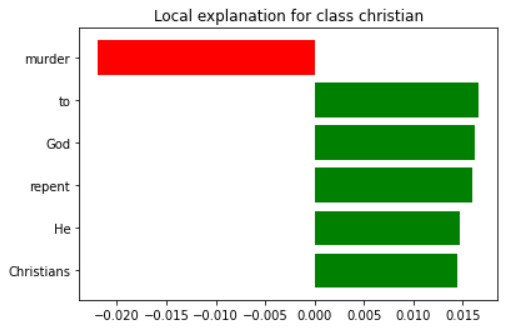
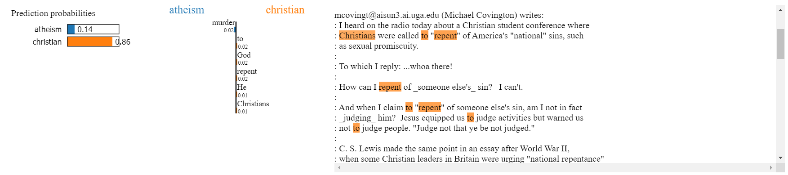

# FLC_Model_Explainers


## What is a model explainer? - James

What is a model explainer?
A model explainer is a function designed to show how the model produces different predictions.
Models in 2D are relatively easy to describe. For example, there we could have a classification model determined by a single line.


However, models frequently have more than 2 features, and so cannot be easily placed on a single chart. However, a model explainer can help us answer the following questions.
Which features are the most important?
How does changing those features impact the prediction?
Is the model more complicated than it needs to be?


## What does the information mean that the model explainer gives us? - Richard

This information allows us to see inside the Blackbox of what a ML model is doing.


## Various Model Explainers - Derek

https://www.analyticsvidhya.com/blog/2020/03/6-python-libraries-interpret-machine-learning-models/
Depending on the project that you are working on, different model explainers will be able to tell you your results in different ways. There are 6 main model explainers, each with their own personality.


# Model Explainer Example Derek LIME
The LIME (Local Interpretable Model-Agnostic) model explainer creates explanations for models which answer the question, "Why can I trust this model?" It does this by providing detailed breakdowns of each decision. Below is an example of using the LIME model explainer to analyze a sentiment analysis project on a group of newsgroup posts about religion.

```python
from __future__ import print_function
import lime
import sklearn
import numpy as np
import sklearn
import sklearn.ensemble
import sklearn.metrics


from sklearn.datasets import fetch_20newsgroups # get dataset
categories = ['alt.atheism', 'soc.religion.christian'] #filter by topic
newsgroups_train = fetch_20newsgroups(subset='train', categories=categories) # divide into train and test groups
newsgroups_test = fetch_20newsgroups(subset='test', categories=categories)
class_names = ['atheism', 'christian']

vectorizer = sklearn.feature_extraction.text.TfidfVectorizer(lowercase=False)
train_vectors = vectorizer.fit_transform(newsgroups_train.data)
test_vectors = vectorizer.transform(newsgroups_test.data)

rf = sklearn.ensemble.RandomForestClassifier(n_estimators=500)
rf.fit(train_vectors, newsgroups_train.target) #fit the model

pred = rf.predict(test_vectors)
print(sklearn.metrics.f1_score(newsgroups_test.target, pred, average='binary'))
```


This model has an F1 score of .91666. Rather than using the sklearn confusion matrix, we can look at what the model is doing much more closely for each decision. Below is an example of how to use the LIME model explainer to look at a local decision.


```python
from lime import lime_text
from sklearn.pipeline import make_pipeline
c = make_pipeline(vectorizer, rf)

print(c.predict_proba([newsgroups_test.data[0]]))

from lime.lime_text import LimeTextExplainer
explainer = LimeTextExplainer(class_names=class_names)

idx = 84 # pick document ID
exp = explainer.explain_instance(newsgroups_test.data[idx], c.predict_proba, num_features=6) # create explainer object
print('Document id: %d' % idx)
print('Probability(christian) =', c.predict_proba([newsgroups_test.data[idx]])[0,1]) # pull out information on the prediction
print('True class: %s' % class_names[newsgroups_test.target[idx]])

print(exp.as_list()) # list top 6 words that made the decision


fig = exp.as_pyplot_figure()
exp.show_in_notebook(text=True)
```



# Model Explainer Example Tanner 


# Model explainer Example Ammon Eli 5
### EXPLAIN LIKE IM 5  (ELI 5)


# Amazing dashboarding for model explainers

https://titanicexplainer.herokuapp.com/classifier/


## (If you have another question that you want to research add it here or below)


resources: 
https://www.kaggle.com/code/dansbecker/advanced-uses-of-shap-values/tutorial
https://medium.com/analytics-vidhya/explain-ml-models-shap-library-5ce375c85d7d
https://www.kaggle.com/code/scratchpad/notebook616777f210/edit
https://spark.apache.org/docs/latest/api/python/reference/api/pyspark.mllib.tree.GradientBoostedTrees.html
https://interpret.ml/docs/lime.html
https://github.com/TeamHG-Memex/eli5

